<style>
  section {
        background-image: url('res/boschfooter.png');
        background-repeat: no-repeat;
        background-position: bottom 0px right;
        background-size: 100% 30px ;
    }
    ul {
        font-size: 0.8em;
    }
</style>

## Relational Deep Learning: Graph Representation Learning on Relational Databases

<span style="color:grey">By:</span> Matthias Fey, Weihua Hu, Kexin Huang, Jan Eric Lenssen, Rishab Ranjan, Joshua Robinson, Rex Ying, Jiaxuan You, Jure Leskovec

---

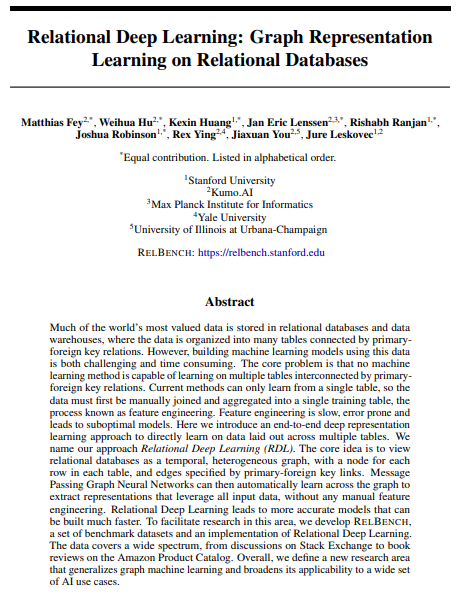

## Agenda

* Background
    - Graph Theory
    - Machine Learning (on Graphs)
    - Relational DBs
* Paper
    * Motivation
    * RelBench
    * Ideas
    * Future Work


---

### Graph Theory

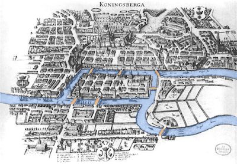

* What's a Graph
    * Nodes & Edges
* Why would I care
    * They're everywhere


---

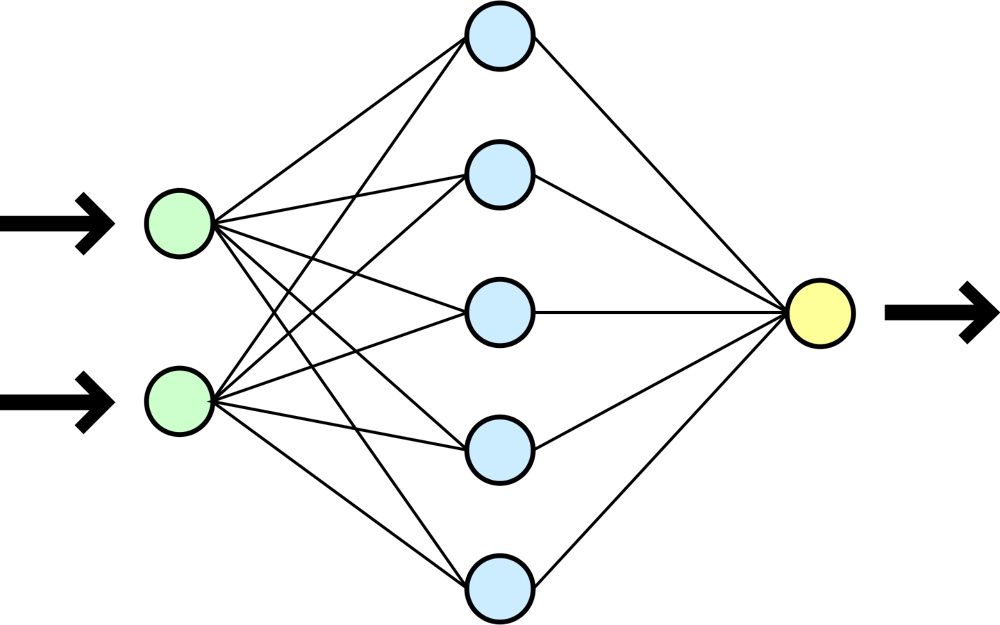

### ML (on graphs)

* NNs are $\vec{X} \rightarrow \vec{y}$ approximators
* Graphs are not Vectors

---

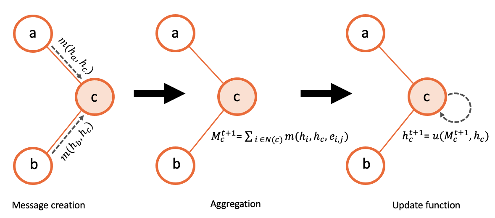

### Solution: Message Passing :envelope:

<div style="text-align: left;">
&plus; much better than feeding adj matrix

&minus; expensive for large receptive fields
</div>

---

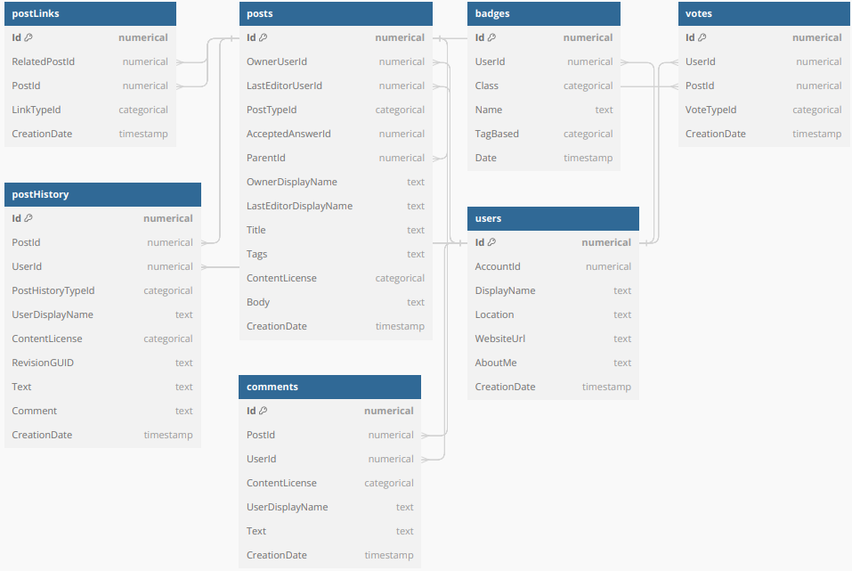

### Relational DBs

* Tables (facts/dimensions) with diverse typed entries
* Linked via keys
* Store $\approx \! 72\%$ of the worlds data
* Easily queried

---

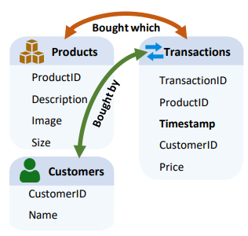

### Schema Graph

- Nodes: Tables
- Edges: possible FK Relations

---

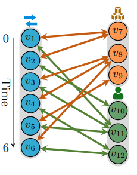

### Relational Entity Graph

- Nodes: Rows
- Edges: concrete FK Relations

---

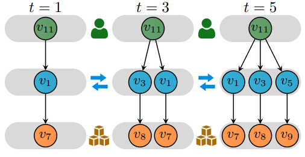

### Time Consistent Computation Graph

- Nodes: Rows
- Edges: temporally constrained FK Relations
---

### Motivation

* Feature engineering is slow, arbitrary and suboptimal
* Temporal drift is easily mistreated: ignored/leaked
* Schema changes make previous solutions obsolete

---

## RelBench :chair:

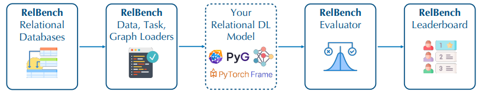


---

<div class="textcolumns">

<div>

#### Day-0 Datasets

* Rel-Amazon
    - 1996-2018
    - 1.8M Customers
    - 22M Reviews
    - 500K Products (Books)
* Rel-Stackex
    - 2009-2023
    - 333K Users
    - 415K Posts
    - 794K Comments
    - 1.67M Votes
    - 103K Post Links
    - 590K Badges

</div>

<div>
 
#### Pipeline
```Python
from relbench.datasets import get_dataset
dataset = get_dataset(name="rel-amazon")

task = dataset.get_task("rel-amazon-ltv")
task.train_table, task.val_table, task.test_table
```
----*magic*----
```Python
task.evaluate(pred)
```
</div>

</div>


---

### Day-0 Tasks

<div class="textcolumns">

<div>

##### Amazon

* Regress User LTV
* Classify if User churns

</div>

<div>

##### Stack Exchange

* Regress 6mo Upvote Count
* Classify if User active


</div>


</div>

---

## Ideas :bulb:

---


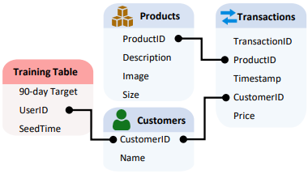

### Training Table :muscle:

* Stores Labels and relevant Entities
* GNN essentially learns SQL operations

---

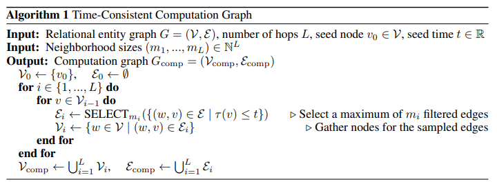

### Temporal Sampling:hourglass:

* Uniform
* Ordered
* Biased

---


### Task-Specific GNNs :globe_with_meridians:

* Separate encoders for each link type & column
* Relational-temporal message passing layers
* Task-specific head


---

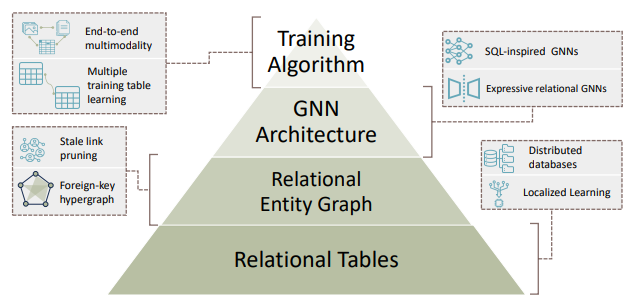

### Future Work :rocket:


---

### Thanks for listening!
##### Questions, Notes, Ideas?

