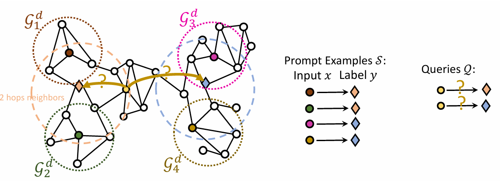
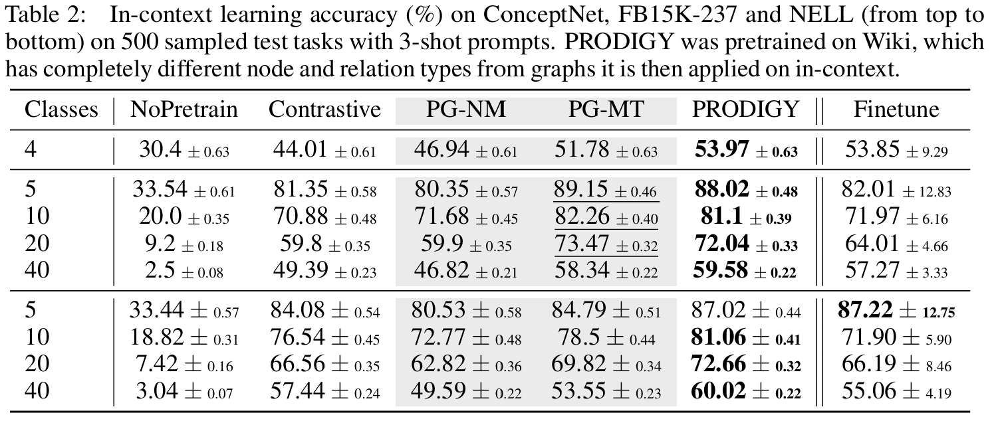

## PRODIGY: Enabling In-context Learning Over Graphs

Authored by: Qian Huang, Hongyu Ren, Peng Chen, Gregor Kržmanc, Daniel Zeng, Percy Liang, 
Jure Leskovec

---

## Agenda

* Background
    - Machine Learning (on Graphs)
    - In-Context Learning

* Paper
    * Motivation
    * Approach
    * Results

---

### ML (on graphs)

* NNs are $\vec{x} \rightarrow \vec{y}$ approximators
* Graphs are not Vectors

---

### Solution: Message Passing :envelope:

&plus; superior to feeding adj. matrix

&minus; expensive for large receptive fields

---

### Tasks

* Node / Edge / Graph Classification
* Node- / Edge Attribute Regression
* Link Prediction
* Clustering

---

### In-context learning

* learn from examples at inference
* emergent behavior of foundation models

---

### Motivation :construction:

* Graph foundation models suck
* Finetuning is expensive
* In-Context learning is data efficient

---

### Approach :bulb:

* Few Shot Formulation
* Prompt Graph
    - Data Graph
    - Task Graph
* Pretraining
    * Message Passing
    * Objectives
        - Neighbor Matching
        - Multi-Task
    * Augmentation

---

### Few Shot Formulation :heavy_division_sign:

A $k$-shot prompt over $m$ classes combines:

- Examples: $\mathcal{S} = \{(x_i, y_i)\}_{i=1}^{m*k}$
- Queries: $\mathcal{Q} = \{x_j\}_{j=1}^{n}$
- Source Graph: $\mathcal{G}$ :exclamation:

---

### Prompt Graph

---

### Data Graph :floppy_disk:

* Goal: Capture relevant source structure
* Implicit solution: 
    -> embeddings
* Explicit solution: 
    -> sampling neighborhoods

---

### Task Graph :hammer_and_wrench:

* Goal: capture relationship to targets
* Process: 
    * Fully connect data nodes and targets
    * Assign edge weights according to label
    * Predict edge weights for query - target edges

---

### Pretraining :books:

---

### Message Passing :love_letter:

* Embed data nodes
* For link prediction:
    -> concat embeddings for start and end (plus pool for normalization) & project down to original size

* Embed target nodes
* Readout $P(target)$ by $cosine(query, target)$

---

### Objectives :dart:

#### Neighbor Matching

* sample neighborhoods
* construct prompt graph for self supervision

#### Multi Task

* If explicit labels exist:
    -> construct a prompt graph for supervision

---

### Neighbor Matching Illustrated

    

---

### Augmentation :wrench:

* increase robustness by learning pertubations
    - Node dropping
    - feature masking
    - no edge corruption (?)

---

### Loss :chart_with_downwards_trend:

$$ \mathcal{L} = 
\underset{x_i \in \mathcal{Q}_{NM}}{\mathbb{E}} CE(O_{NM,i}, y_{NM,i}) + 

\underset{x_i \in \mathcal{Q}_{NM}}{\mathbb{E}} CE(O_{MT,i}, y_{MT,i})$$

$CE$: Cross Entropy
$O_{task,i}$: logits over input  $G_i^{aug}$ from $\mathcal{Q}_{task}$
$y_{task,i}$ : label of $x_i$ in $\mathcal{Q}_{task}$

---

### Results :trophy:

* Citations
Pretrain: MAG240M
Eval: arXiv
* Knowledge Graphs
Pretrain: Wiki
Eval: ConceptNet, FB15K-237, NELL

---

### Citation Networks

---

### Knowledge Graphs

---

### Takeaways :pizza:

* similar to better than finetune
* much better than contrastive
* NM works as a surrogate task
* outperforms state-of-the-art TENT
* slower to saturate with data than constrastive

---

### Thanks for listening!
##### Questions, Notes, Ideas?

